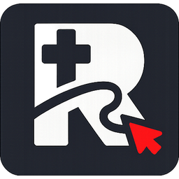
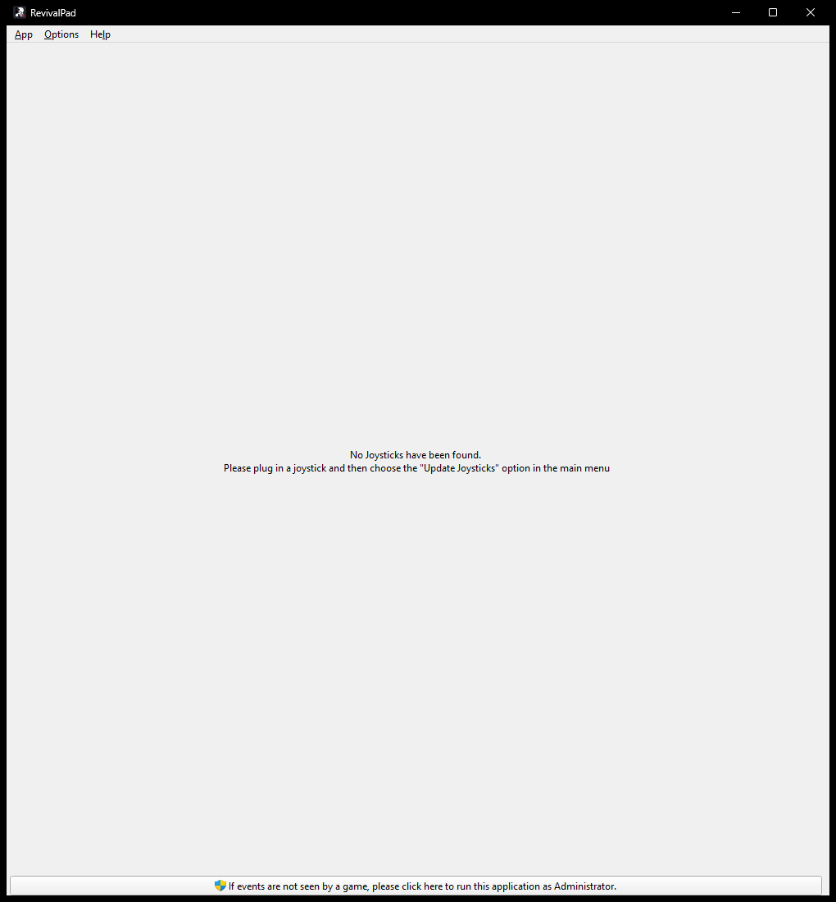
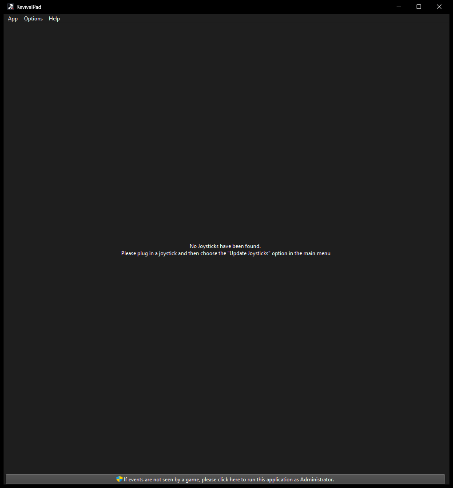

# RevivalPad

Map your gamepad to keyboard keys, mouse movement, macros and scripts — and
control any desktop application with it.

Linux and Windows. Qt 5/6, SDL2.

## Screenshots

| Light | Dark |
| --- | --- |
|  |  |

## Features

- Map buttons, sticks and triggers to keyboard, mouse, scripts or macros
- Multiple switchable mapping sets per controller
- Auto profiles — bind a profile to the active window
- Controller calibration and gamepad mapping
- Gyroscope and accelerometer support
- Runs alongside AntiMicroX without conflicting

## Install

Download a release from the
[Releases page](https://github.com/0x1-1/revivalpad/releases), or build it:

```bash
cmake -S . -B build -DCMAKE_BUILD_TYPE=Release
cmake --build build --parallel
```

Dependencies and platform notes: [BUILDING.md](./BUILDING.md).

## Usage

```bash
revivalpad            # start
revivalpad --tray     # start minimised to the tray
revivalpad --help     # all options
```

Settings live in `~/.config/revivalpad/` on Linux and
`%LocalAppData%\revivalpad\` on Windows. Existing AntiMicroX settings and
`.amgp` profiles are imported automatically on first run.

## License

GPL-3.0-or-later. See [LICENSE](./LICENSE).

RevivalPad is a modified fork of [AntiMicroX](https://github.com/AntiMicroX/antimicrox)
3.6.1; its authors retain copyright over their contributions. Details in
[FORK_NOTICE.md](./FORK_NOTICE.md). Report RevivalPad issues
[here](https://github.com/0x1-1/revivalpad/issues), not to AntiMicroX.
